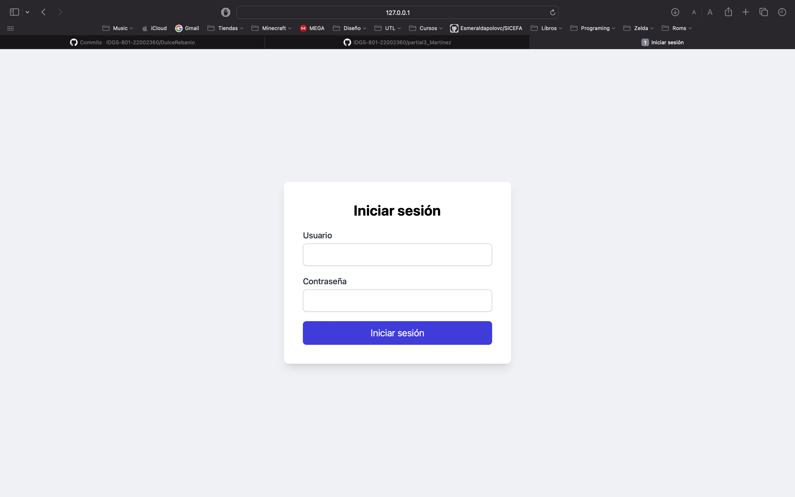
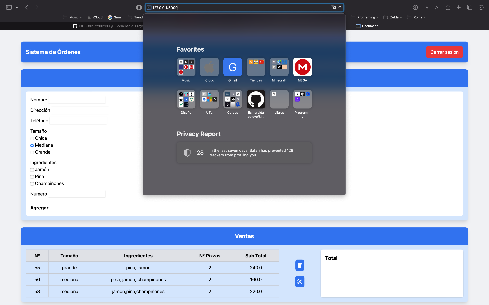
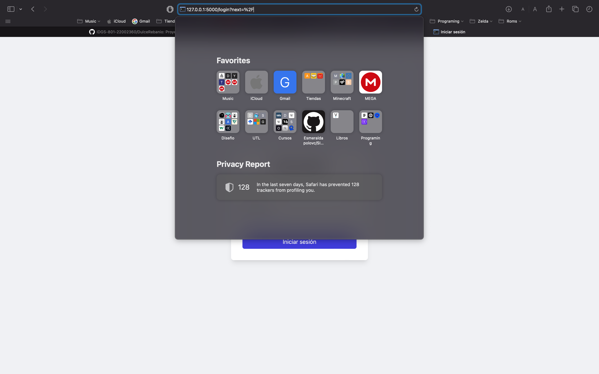

# Flask-Login

Este repositorio contiene un ejemplo práctico de cómo implementar autenticación de usuarios en una aplicación Flask utilizando la extensión `flask-login`. Además, se utiliza **Tailwind CSS** y **Flowbite** para diseñar una interfaz de usuario moderna y responsiva.

---

## Que es Flask-Login?
Flask-Login es una extensión de Flask que facilita la administración de sesiones de usuario y la autenticación en aplicaciones web. Su propósito principal es manejar el inicio y cierre de sesión, recordar a los usuarios en diferentes sesiones y restringir el acceso a ciertas partes de la aplicación según el estado de autenticación del usuario.
Principales características y funcionalidades de Flask-Login
- **Gestión de sesiones:** Mantiene a los usuarios conectados entre diferentes solicitudes.
- **Autenticación de usuarios:** Permite verificar si un usuario ha iniciado sesión o no.
- **Recuperación de usuarios:** Carga automáticamente la información del usuario autenticado.
- **Protección de rutas:** Permite restringir el acceso a ciertas páginas solo para usuarios autenticados.
- **Compatibilidad con múltiples métodos de autenticación:** Se puede combinar con bases de datos, OAuth y otros sistemas de autenticación.

---

## Descripción

El proyecto incluye:
- Un sistema de autenticación con `flask-login`.
- Rutas protegidas que solo son accesibles para usuarios autenticados.
- Un diseño atractivo y responsivo utilizando **Tailwind CSS** y **Flowbite**.
- Un flujo de inicio de sesión, cierre de sesión y acceso a páginas protegidas.

---

 ## Instalación
 
 Sigue estos pasos para configurar y ejecutar el proyecto en tu máquina local:
 
 1. Clona este repositorio:
    ```bash
    git clone https://github.com/IDGS-801-22002360/partial3_Martinez.git
    cd flask-login
 
 2. Crea un entorno virtual e instala las dependencias
     ```bash
     python3 -m venv venv
 - para **Windows**
     ```bash
     Source venv/Scripts/activate
     pip install -r requirements.txt
     
 - Para **MacOs**
     ```bash  
     Source venv/bin/activate
     pip install -r requirements.txt
 ___


## Funcionalidades principales:
**Inicio de sesión:**
Ingresa con las credenciales de usuario predefinidas
Usuario: marco, Contraseña: 1234

Si las credenciales son correctas, serás redirigido a la página de bienvenida

**Rutas protegidas:**
la aplicacion tiene como rutas protegidas el index, que es donde se hacen las ordenes, de esta forma no se puede acceder si no se esta logeado

**Cierre de sesión:**
Solamente hay que hacer click en el boton de "Cerrar sesion" para que se cierre la sesion del usuario, y una vez hecho el
usuario ya no podra acceder a ninguna de las rutas, en automatico lo redirigira a la pagina de login

## Ejecucion
1. Primero, cuando ejecutamos la aplicacion nos mandara a la pagina de `Login`


2. Despues ingresamos las credenciales del usuario


3. Una vez ingresadas las credenciales podremos entrar a la pagina principal


4. en ella podremos ver las opciones de "Cerrar sesion"


5. ya dentro podremos usar la aplicacion como es debido, podremos guardar ordenes, eliminar o hacer el corte de estas


6. ahora veremos la ruta, como se dijo en los puntos anteriores el metodo para guardar esta en el index


7. si cerramos sesion podremos ver que nis vuelve a redirigir al login, pero para ver que funciona el Flask-Login, podemos tratar de ir a la ruta index e intentar entrar, podremos ver que no nos deja y en su defecto se vera una redireccion el login


---

## Comprobacion
ahora se muestra un video a mas detalle de su funcionamiento
[Descargar video](static/img/sr.mov)

